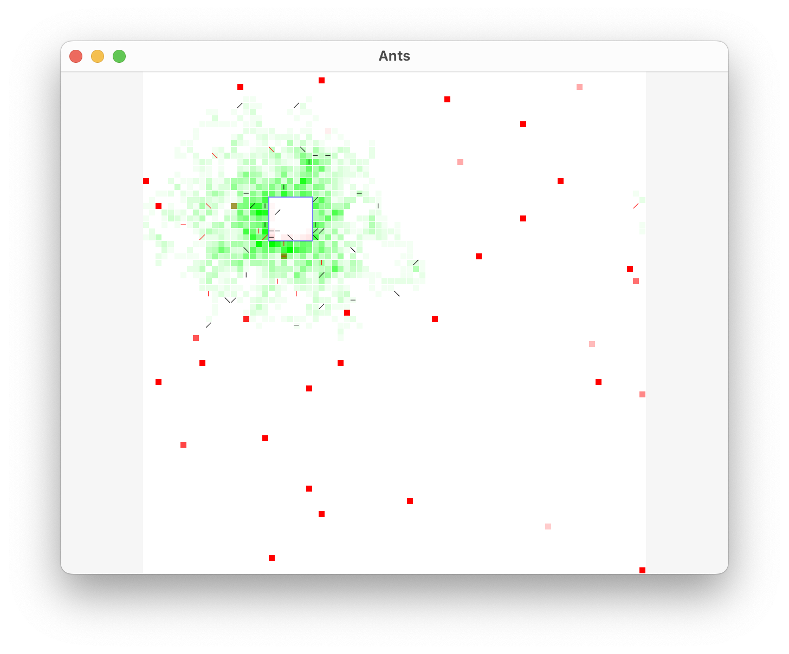

# Rich Hickey’s Ants demo in [Humble UI](https://github.com/HumbleUI/HumbleUI)



Code adjusted from https://gist.github.com/michiakig/1093917

# Running

Humble UI + nREPL:

```sh
clj -M -m ants.humbleui --interactive
```

AWT (origian Rich’s demo):

```sh
clj -M -m ants.awt
```